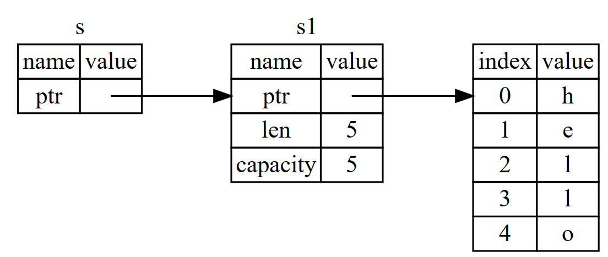

# Rust

## Ownership

### rules

- 每个值都有一个所有者
- 一次只能有一个所有者
- 当所有者超出范围时，值将被删除

> 在 rust 中拥有内存的变量一旦退出作用域，内存就会自动返回。

```rust
let s1 = String::from("hello")
```


```rust
let s2 = s1
```


### 所有权 Move

只复制堆栈上数据，同时使先前变量失效

### Clone

不仅赋值堆栈上数据，同时复制堆上数据

### Refrence 引用

使用引用不会引起值的所有权发生转移



```rust
let s1 = String::from("hello")
let s = &s1
```

> rust 可以保证一个引用永远不会成为悬空引用
