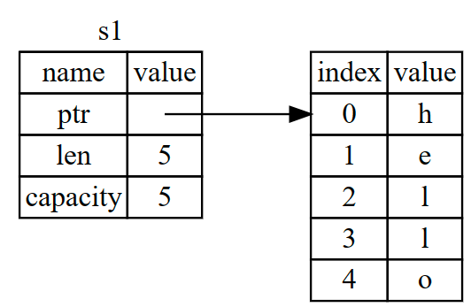
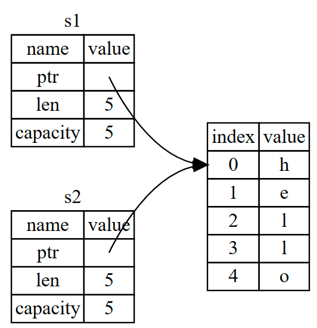
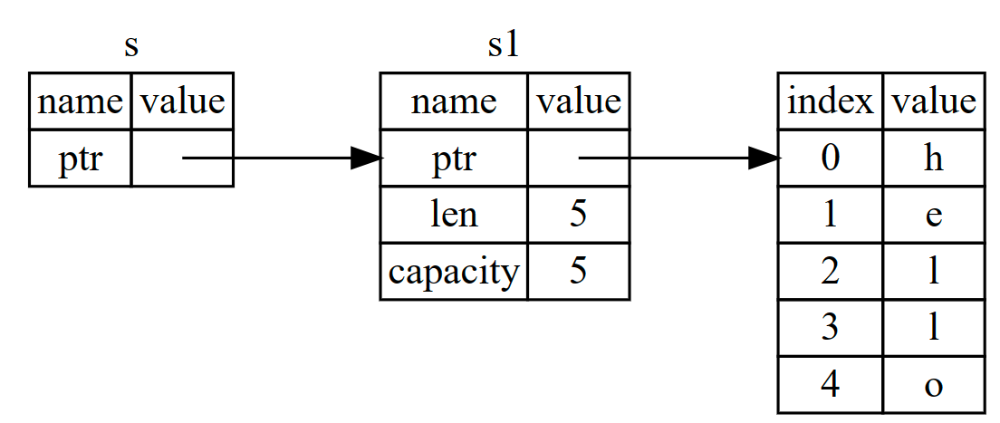

## Ownership

### rules

- 每个值都有一个所有者
- 一次只能有一个所有者
- 当所有者超出范围时，值将被删除

> 在 rust 中拥有内存的变量一旦退出作用域，内存就会自动返回。

```rust
let s1 = String::from("hello")
```



```rust
let s2 = s1
```



### 所有权 Move

只复制堆栈上数据，同时使先前变量失效

### Clone

不仅赋值堆栈上数据，同时复制堆上数据

## 引用 与 借用

使用引用不会引起值的所有权发生转移



```rust
let s1 = String::from("hello")
let s = &s1
```

> rust 可以保证一个引用永远不会成为悬空引用

最后总结引用规则

- 在任何时候，你都可以拥有一个可变引用或任意数量的不可变引用
- 引用必须始终有效

## 切片

切片允许你引用集合数据的子序列

创建方法:`&variable_name[start_index..end_index]`

字符串切片类型表示为: `&str`
